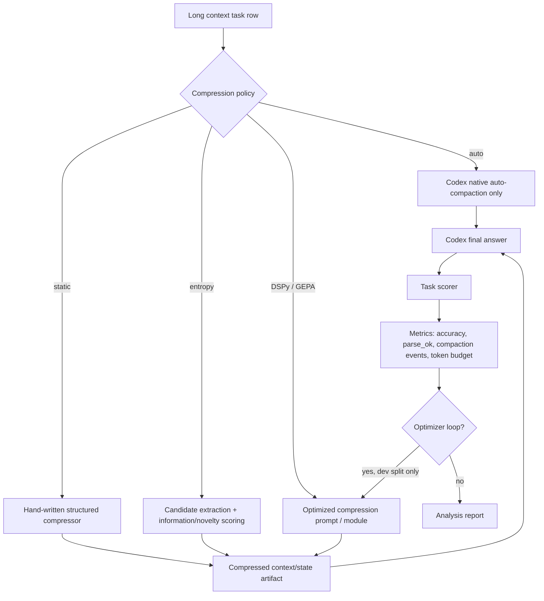

# Optimized Compaction Memory — Comparison and Sprint Plan

Date: 2026-04-27  
Slug: `optimized-compaction-memory`

## Short answer

For now, we should **not** turn this into a broad agent-memory project.

The more focused version is:

> Treat compaction as a **compression policy** problem: what should be preserved, under a token budget, so the downstream model can still answer correctly?

The surrounding research suggests a good next sprint:

1. Use **long-context benchmarks** to define what kinds of information are easy/hard to preserve.
2. Use **prompt/context compression** papers for candidate compression mechanisms.
3. Use **entropy / novelty / redundancy** ideas to select high-value facts.
4. Use **DSPy / GEPA / TextGrad / OPRO-style optimization** only after we have a small, measurable compression loop.

So the near-term policies should be reframed slightly:

| Policy | Better near-term meaning |
|---|---|
| `auto` | normal Codex auto-compaction baseline |
| `auto+static-notebook` | hand-written structured compression prompt; not a full memory system |
| `auto+entropy-notebook` | entropy/novelty-guided selection before compression |
| `auto+dspy/gepa-notebook` | optimized compression prompt/policy using held-out task accuracy |

In other words, “notebook” should mean **compressed state artifact**, not long-term memory architecture.

---

## Main takeaways

### 1. Prompt compression is real, but task-sensitive

LLMLingua, LongLLMLingua, Selective Context, RECOMP, LLMLingua-2, Gist Tokens, and AutoCompressors all support the idea that long prompts contain removable redundancy. However, they compress different objects:

- whole prompts,
- retrieved documents,
- repeated instructions,
- task demonstrations,
- soft summary vectors,
- or long-context inputs.

That means we should not copy one method blindly. CompactionBench needs a compressor that preserves **answer-critical state**, not just semantic similarity.

### 2. Long-context benchmarks disagree on what “long-context ability” means

Needle-in-a-haystack mostly tests exact retrieval. RULER expands this to multi-needle, tracing, and aggregation. BABILong tests symbolic reasoning in noise. OOLONG tests aggregation over many local decisions. LongMemEval tests long-term interactive memory, temporal reasoning, updates, and abstention.

This supports our benchmark design: BABILong and OOLONG are complementary. They should be kept separate in analysis because they stress different failure modes.

### 3. Entropy is useful, but probably insufficient by itself

Selective Context uses self-information to filter less informative content. LLMLingua-2 explicitly argues that causal-LM entropy can be a suboptimal compression metric because it is unidirectional and not fully aligned with prompt-compression objectives. MMR-style selection adds a classic lesson: relevance must be balanced against redundancy.

So entropy should be a **candidate filter**, not the final policy.

A good heuristic stack is:

```text
value(fact) = rarity + query relevance + entity binding + number/date/path/ID + novelty + correction/contradiction + recency
```

### 4. Prompt optimizers are promising, but should come after a stable benchmark loop

DSPy, OPRO, TextGrad, PromptBreeder, and GEPA all show versions of “use feedback to improve prompts/pipelines.” But none of them directly proves that optimized compression beats native auto-compaction on long-context agent traces.

The opportunity is to optimize the **compressor**, not the final answer prompt:

```text
long context → compression policy → compressed context/state → answer model → score
```

The optimizer’s target should be final answer accuracy plus compactness and factual support.

---

## Comparison matrix

| Source | Key claim | Evidence type | Relevance to this project | Caveats | Confidence |
|---|---|---:|---|---|---|
| Selective Context / self-information filtering ([arXiv:2304.12102](https://arxiv.org/abs/2304.12102)) | Less informative content can be filtered using self-information to improve context efficiency. | Experiments on summarization and QA. | Directly supports `entropy-notebook` / entropy-guided compression. | Self-information alone may miss task-critical but predictable facts; not tested as Codex compaction replacement. | High for entropy as a useful signal; medium as a full policy. |
| Gist Tokens ([arXiv:2304.08467](https://arxiv.org/abs/2304.08467)) | Prompts can be compressed into learned “gist” tokens that are cached/reused. | Model adaptation experiments. | Shows compression can be learned, not only heuristic. | Requires model training/control; less practical for black-box Codex. | Medium. |
| AutoCompressors ([arXiv:2305.14788](https://arxiv.org/abs/2305.14788)) | LMs can be adapted to compress long contexts into soft prompt summary vectors. | Unsupervised adaptation + ICL evaluation. | Supports the broad idea that context summaries can act as compact substitutes. | Soft prompts require model access/training; not directly available for Codex. | Medium. |
| LLMLingua ([arXiv:2310.05736](https://arxiv.org/abs/2310.05736)) | Coarse-to-fine token-level prompt compression can reduce cost while preserving performance. | Multi-dataset experiments including reasoning, chat, and arXiv-like prompts. | Strong baseline for hard prompt compression. | Compression aims at prompt efficiency, not necessarily preserving evolving state after auto-compaction. | High. |
| LongLLMLingua ([arXiv:2310.06839](https://arxiv.org/abs/2310.06839)) | Long-context performance depends on key-info density and position; prompt compression can improve both cost and performance. | Long-context benchmark evaluations; reports gains such as improved NQ performance and lower LooGLE cost. | Very relevant: CompactionBench also sees long-context pressure and position/compaction effects. | Query-aware compression may overfit to known final question; need query-blind vs query-aware split. | High. |
| RECOMP ([arXiv:2310.04408](https://arxiv.org/abs/2310.04408)) | Retrieved documents can be compressed into summaries before being used in-context; compressors can be trained to improve downstream task performance. | RAG task experiments with extractive and abstractive compressors. | Important because it optimizes compression for downstream answer quality, not just shorter text. | Retrieval setting differs from full-context compaction; documents are retrieved first. | High for objective design; medium for direct transfer. |
| LLMLingua-2 ([arXiv:2403.12968](https://arxiv.org/abs/2403.12968)) | Entropy-based compression is not always aligned with the compression objective; token classification from distilled data can be more faithful. | Task-agnostic compression experiments. | Warns us not to rely only on entropy. Supports learning/optimizing the selection policy. | Requires training data; may not capture agent-specific state. | High. |
| PCToolkit ([arXiv:2403.17411](https://arxiv.org/abs/2403.17411)) | Prompt compression methods need standardized tooling, datasets, metrics, and plug-and-play evaluation. | Toolkit + evaluations across tasks. | Useful implementation inspiration: CompactionBench could add a compression-policy interface and compare methods. | Toolkit metrics may not cover compaction events or agent traces. | Medium-high. |
| Prompt Compression Survey ([arXiv:2410.12388](https://arxiv.org/abs/2410.12388)) | Prompt compression includes hard and soft methods; mechanisms can be understood through attention, PEFT, synthetic language, and downstream adaptation. | Survey. | Helps organize the method space. | Survey-level evidence; does not provide one definitive method. | Medium. |
| Lost in the Middle ([arXiv:2307.03172](https://arxiv.org/abs/2307.03172)) | LMs often use information less reliably when it appears in the middle of long contexts. | Multi-document QA and key-value retrieval experiments. | Explains why compaction/key-info placement may matter. | Not a compaction paper; studies raw long-context use. | High for position-bias concern. |
| Needle-in-a-haystack testing ([GitHub](https://github.com/gkamradt/LLMTest_NeedleInAHaystack)) | Long-context models can be probed by hiding a target fact in long distractor text. | Community benchmark/tooling. | Good simple sanity check for exact retrieval. | Too shallow by itself; RULER and BABILong explicitly critique simple NIAH. | Medium. |
| LongBench ([arXiv:2308.14508](https://arxiv.org/abs/2308.14508)) | Long-context understanding needs multitask evaluation across QA, summarization, few-shot, synthetic, and code tasks. | Benchmark paper. | Supports broad evaluation beyond one task family. | Average lengths are lower than extreme compaction regimes; less focused on auto-compaction. | Medium. |
| Infinity-Bench ([arXiv:2402.13718](https://arxiv.org/abs/2402.13718)) | Benchmarks should extend beyond 100K tokens and include realistic + synthetic tasks requiring long dependencies. | Benchmark paper. | Supports testing at compaction-relevant lengths. | Not specifically about compressed agent sessions. | Medium-high. |
| RULER ([arXiv:2404.06654](https://arxiv.org/abs/2404.06654)) | Vanilla NIAH is superficial; long-context eval should include multi-needle, multi-hop tracing, and aggregation. | Synthetic benchmark over 17 long-context LMs. | Directly supports our mix of retrieval + aggregation + tracing tasks. | Synthetic; still not the same as Codex auto-compaction. | High. |
| BABILong ([arXiv:2406.10149](https://arxiv.org/abs/2406.10149)) | Reasoning over facts distributed in long noise reveals sharp limits; popular LLMs may effectively use only a fraction of long context. | Benchmark with 20 reasoning tasks. | Core CompactionBench benchmark for exact symbolic retention under long noise. | Strict exact scoring can undercount semantically correct answers; needs judge only as secondary. | High. |
| LongMemEval ([arXiv:2410.10813](https://arxiv.org/abs/2410.10813)) | Long-term chat memory requires extraction, multi-session reasoning, temporal reasoning, updates, and abstention; systems show large drops over sustained interaction. | Benchmark with scalable chat histories. | Useful for future state/update tasks, even if we are not doing full memory systems now. | More interactive-memory oriented than prompt compression. | Medium-high. |
| OOLONG ([arXiv:2511.02817](https://arxiv.org/abs/2511.02817)) | Long-context eval should include aggregation over many atomic local analyses, not just retrieval from a small region. | Benchmark with synthetic and real task sets. | Core complement to BABILong: aggregation under long context/compaction. | Newer benchmark; our current prepared OOLONG-synth subset is not yet fully diversified. | High. |
| DSPy ([arXiv:2310.03714](https://arxiv.org/abs/2310.03714)) | LM pipelines can be written as declarative modules and compiled/optimized against metrics instead of hand-written prompts. | Framework + case studies. | Good fit for optimizing a compression module after we define train/dev/test and score. | Does not automatically solve compressor design; needs clean metrics and examples. | High for optimization framework; medium for compression transfer. |
| OPRO ([arXiv:2309.03409](https://arxiv.org/abs/2309.03409)) | LLMs can act as optimizers by proposing new prompts/solutions from prior scores. | Optimization and prompt-optimization experiments. | Simple baseline for optimizing compressor instructions. | Can overfit small dev sets; less structured than DSPy/GEPA. | Medium. |
| TextGrad ([arXiv:2406.07496](https://arxiv.org/abs/2406.07496)) | Textual feedback can be backpropagated through compound AI systems to improve components. | Framework + examples across variable types. | Good conceptual fit: use error feedback to improve the compressor, not just final answer. | More general framework; direct long-context compaction evidence absent. | Medium-high. |
| PromptBreeder ([arXiv:2309.16797](https://arxiv.org/abs/2309.16797)) | Prompt populations can evolve using LLM-generated mutation prompts. | Prompt evolution experiments. | Supports search over compression instructions/schemas. | Evolution can be compute-heavy and overfit; not necessarily stable for small data. | Medium. |
| GEPA ([arXiv:2507.19457](https://arxiv.org/abs/2507.19457)) | Reflective prompt evolution can use natural-language trajectory feedback and Pareto selection to improve prompts efficiently. | Prompt optimizer paper. | Very relevant after we log compression trajectories and downstream errors. | Newer method; need implementation maturity check and careful held-out evaluation. | Medium-high. |
| Maximal Marginal Relevance / MMR ([PDF](https://www.cs.cmu.edu/~jgc/publication/The_Use_MMR_Diversity_Based_LTMIR_1998.pdf)) | Selection should balance relevance with novelty/diversity to avoid redundancy. | Classic IR/summarization method. | Useful for entropy/novelty compressor: avoid keeping many duplicate facts. | Old IR setting; needs adaptation to long-context facts/chunks. | High as a design principle. |

---

## Agreement

### A. Long contexts contain compressible redundancy

Compression papers broadly agree that raw prompts/documents contain redundancy. Selective Context removes low-information content; LLMLingua compresses prompts token-by-token; RECOMP compresses retrieved documents; Gist Tokens and AutoCompressors learn compact substitutes.

For CompactionBench, this means:

> It is plausible that a better explicit compressor can preserve answer-critical information in fewer tokens than the raw context.

### B. Compression must be task-aware or at least task-evaluated

LongLLMLingua and RECOMP are especially important here. They do not treat compression as just shortening text; they care about whether the downstream model answers better. LLMLingua-2 further warns that entropy alone is not necessarily aligned with compression quality.

For CompactionBench:

> The metric should be final task score, not ROUGE, semantic similarity, or pretty summaries.

### C. Needle-style retrieval is insufficient

Lost in the Middle, RULER, BABILong, OOLONG, and LongMemEval all push beyond simple “can you find the hidden fact?” evaluation.

They agree that long-context ability has several separate dimensions:

- exact retrieval,
- position robustness,
- multi-hop tracing,
- aggregation,
- temporal update tracking,
- abstention,
- reasoning over distributed facts.

For CompactionBench:

> Keep BABILong and OOLONG separate. They test different kinds of compaction damage.

### D. Prompt/pipeline optimization is mature enough to try

DSPy, OPRO, TextGrad, PromptBreeder, and GEPA all support the idea that prompts and pipeline components can be optimized with feedback.

For CompactionBench:

> We can optimize a compression policy against held-out benchmark accuracy, but only after building a small stable compressor/evaluator loop.

---

## Disagreement and uncertainty

### 1. Entropy: useful signal or misleading proxy?

- Selective Context supports self-information as a useful filter.
- LLMLingua-2 argues entropy can be suboptimal because it is unidirectional and not aligned with the compression objective.

Interpretation:

> Entropy should help find candidate facts, but should not be the only selector.

Use entropy together with:

- query relevance,
- entity/value detection,
- novelty,
- recency,
- contradiction/update detection,
- redundancy penalty.

### 2. Query-aware vs query-blind compression

LongLLMLingua and RECOMP can exploit task/query information. That is powerful, but in agent compaction the future question may not be known.

For CompactionBench, we should test both:

| Setting | Meaning | Why it matters |
|---|---|---|
| Query-aware | compressor sees the final question | upper bound / easier setting |
| Query-blind | compressor does not see final question | closer to real auto-compaction |

If query-aware compression works but query-blind fails, the result is still useful but not enough to claim better agent compaction.

### 3. Hard vs soft compression

Soft-token methods like Gist Tokens and AutoCompressors can be powerful, but they require model adaptation or access to internals. Hard textual compression works with black-box Codex but may be less efficient.

For this project:

> Start with hard textual compression. Soft compression is background, not a near-term implementation target.

### 4. Optimizers may overfit the benchmark

DSPy/GEPA/TextGrad/OPRO can optimize prompts. But if the dev set is tiny, the compressor may learn benchmark quirks instead of a general compaction policy.

Mitigation:

- optimize on synthetic training tasks,
- validate on held-out synthetic tasks,
- test transfer to BABILong/OOLONG/OOLONG-real,
- report if gains do not transfer.

---

## Method map



Important design choice:

> For now, this is a **compression-policy pipeline**, not a long-term memory architecture.

The artifact may look notebook-like, but the sprint should evaluate it as compressed context under a token budget.

---

## Implications for CompactionBench

### Near-term policy table

| Policy | Implementation idea | What it tests | Risk |
|---|---|---|---|
| `auto` | Existing Codex auto-compaction with pinned limit. | Baseline. | Opaque; hard to know what was lost. |
| `static-compress` / `auto+static-notebook` | Hand-written prompt turns chunks into a compact structured artifact. | Whether a simple explicit compression format helps. | Hand design may be brittle. |
| `entropy-compress` / `auto+entropy-notebook` | Extract candidate facts, score by rarity/novelty/entity/value/update features, keep top facts under budget. | Whether information-guided selection beats naive summaries. | Entropy can miss predictable but important facts. |
| `optimized-compress` / `auto+dspy/gepa-notebook` | Use DSPy/GEPA/TextGrad/OPRO-style feedback to improve compressor prompt/schema. | Whether compression policy can be learned from task outcomes. | Overfitting, compute cost, noisy metrics. |

### What not to do yet

Do **not** start by building a full agent memory system.

Avoid for now:

- persistent user memory,
- vector-store memory,
- episodic/semantic/procedural agent memory,
- MemGPT/Letta-style hierarchy,
- open-ended autonomous memory editing.

Those may matter later, but they will make the sprint too broad.

### What to build first

Build an **offline compressor benchmark path**:

```text
TaskRow(context, question, gold)
→ compressor(context, optional question, budget)
→ compressed_context
→ Codex answers using compressed_context
→ score
```

This can be tested without changing Codex internals.

---

## Recommended Exploration Sprint

### Sprint what-if

> What if CompactionBench failures are partly caused by low-quality compression, and simple information-guided compression can preserve answer-critical facts better than native auto-compaction?

### Why now?

We already saw:

- BABILong exact symbolic memory is fragile.
- OOLONG-synth aggregation is cleaner but still not solved.
- Compaction becomes load-bearing around `256k+`.
- Current default compaction is opaque.

So the next move is not just more benchmark sweeps. It is to test whether a better compression policy changes outcomes.

### Sprint duration

**1 week.**

No extension unless there is a clear surprising signal.

### Minimum implementation

Add a compressor interface:

```python
class CompressionPolicy:
    def compress(self, *, context: str, question: str | None, budget_tokens: int) -> str:
        ...
```

Implement three simple policies:

1. `static-compress`
   - LLM prompt compresses context into fixed schema:
     - facts,
     - entities,
     - numbers/dates/IDs,
     - updates/corrections,
     - counts,
     - unresolved conflicts.

2. `entropy-compress`
   - split context into sentences/chunks,
   - score each by simple features:
     - rare tokens,
     - named entities,
     - numbers,
     - dates,
     - paths/IDs,
     - novelty vs already kept text,
     - query relevance if query-aware,
     - update/correction markers.
   - keep top chunks/facts under budget.

3. `optimized-compress-lite`
   - not full GEPA yet.
   - start with manual prompt variants or a tiny DSPy/OPRO loop over 10–20 dev examples.
   - optimize compressor instruction, not answer prompt.

### Two modes to test

| Mode | Compressor sees final question? | Why |
|---|---:|---|
| query-aware | yes | upper bound; close to LongLLMLingua/RECOMP style |
| query-blind | no | closer to real compaction |

### Mini evaluation matrix

Keep this small.

| Benchmark | Tasks | Lengths / scale | Why |
|---|---|---|---|
| BABILong | `qa1`, `qa11`, `qa14` | `256k`, `1M` | exact memory, symbolic binding, update-ish reasoning |
| OOLONG-synth | `counting`, `timeline` | `256k`, `1M` | aggregation over many local facts |
| OOLONG-real | `multidoc_rolls`, `multidoc_spells` | `6ep`, `16ep` | naturalistic transcript aggregation |
| Synthetic surgical | stale update, entity binding, counting | generated | mechanism isolation |

### Metrics

Primary:

- deterministic task accuracy,
- parse success,
- compression ratio,
- answer latency/cost if available.

Secondary:

- compaction events,
- judge-adjusted accuracy only for borderline/format cases,
- unsupported facts in compressed artifact,
- whether query-aware gains transfer to query-blind.

### Expectations

I expect:

1. `static-compress` helps some exact-memory tasks but is inconsistent.
2. `entropy-compress` helps entity/value/count tasks more than broad reasoning.
3. query-aware compression beats query-blind compression.
4. optimized compression only becomes useful after the static/entropy baselines expose repeatable errors.

### What would genuinely surprise me?

1. **Entropy compression beats everything immediately.**
   - That would suggest most compaction failures are about selecting rare/high-information facts, not deep reasoning.

2. **Compression hurts OOLONG but helps BABILong.**
   - That would mean aggregation requires broad coverage, while exact-memory tasks benefit from aggressive selection.

3. **Query-blind compression nearly matches query-aware compression.**
   - That would be very strong evidence that generic compaction policies can preserve useful state without knowing the final question.

4. **Optimized prompt compression fails to beat static hand-written compression.**
   - That would suggest schema design matters more than prompt optimization.

### Graduate / shelve / pivot rule

Graduate if:

- a compression policy beats `auto` on at least one exact-memory task family and transfers to at least one held-out benchmark family.

Shelve if:

- all compression variants are noisy or worse than `auto`, and no clear failure pattern emerges.

Pivot if:

- the surprising result is about benchmark type, e.g. compression helps retrieval but damages aggregation.

A good pivot question would be:

> Which task families are compressible, and which require broad context coverage?

---

## Concrete next plan

### Step 1 — Write the compressor interface

Add a lightweight module like:

```text
compactionbench/compression.py
```

with:

```python
CompressionPolicy
StaticCompressionPolicy
EntropyCompressionPolicy
```

Do not add DSPy/GEPA yet.

### Step 2 — Add an offline compression command

Example:

```bash
uv run cbench compress \
  --input data/benchmarks/.../task.jsonl \
  --policy entropy-compress \
  --budget-tokens 20000 \
  --query-aware true \
  --output data/compressed/.../task.jsonl
```

This makes the compressed task row still look like a normal direct-injection benchmark row.

### Step 3 — Score compressed rows with existing runner

No special harness first:

```text
compressed JSONL → direct Codex run → existing scorer
```

This keeps the experiment clean.

### Step 4 — Only then add optimizer

Once static/entropy baselines work, add a small optimizer over compressor prompts:

- dev examples: 20–50 synthetic tasks,
- objective: final answer accuracy minus compression budget penalty,
- held-out: BABILong/OOLONG/OOLONG-real.

Candidate optimizer order:

1. manual prompt variants,
2. OPRO-style loop,
3. DSPy,
4. GEPA.

Do **not** start with GEPA as step one.

---

## Bottom line

The surrounding research supports this direction, but the sharp version is:

> Do not build “memory” yet. Build a small compression-policy benchmark and ask whether smarter compression preserves answer-critical information better than native auto-compaction.

The most grounded sprint is:

```text
auto
vs static compression
vs entropy/novelty compression
vs later optimized compression
```

Test it on:

```text
BABILong exact memory
OOLONG aggregation
OOLONG-real realistic transcripts
small synthetic stale-update/entity-binding tasks
```

If entropy or optimized compression helps, this becomes a real research question:

> What information should long-context agents preserve under compression pressure?

---

## Sources

### Context compression / prompt compression

- Selective Context — “Unlocking Context Constraints of LLMs: Enhancing Context Efficiency of LLMs with Self-Information-Based Content Filtering”: https://arxiv.org/abs/2304.12102
- Selective Context code: https://github.com/liyucheng09/Selective_Context
- “Learning to Compress Prompts with Gist Tokens”: https://arxiv.org/abs/2304.08467
- “Adapting Language Models to Compress Contexts” / AutoCompressors: https://arxiv.org/abs/2305.14788
- AutoCompressors code: https://github.com/princeton-nlp/AutoCompressors
- LLMLingua — “Compressing Prompts for Accelerated Inference of Large Language Models”: https://arxiv.org/abs/2310.05736
- LLMLingua code: https://github.com/microsoft/LLMLingua
- LongLLMLingua — “Accelerating and Enhancing LLMs in Long Context Scenarios via Prompt Compression”: https://arxiv.org/abs/2310.06839
- RECOMP — “Improving Retrieval-Augmented LMs with Compression and Selective Augmentation”: https://arxiv.org/abs/2310.04408
- LLMLingua-2 — “Data Distillation for Efficient and Faithful Task-Agnostic Prompt Compression”: https://arxiv.org/abs/2403.12968
- PCToolkit — “A Unified Plug-and-Play Prompt Compression Toolkit of Large Language Models”: https://arxiv.org/abs/2403.17411
- “Prompt Compression for Large Language Models: A Survey”: https://arxiv.org/abs/2410.12388

### Long-context benchmarks / observations

- “Lost in the Middle: How Language Models Use Long Contexts”: https://arxiv.org/abs/2307.03172
- Needle-in-a-haystack test repository: https://github.com/gkamradt/LLMTest_NeedleInAHaystack
- LongBench — “A Bilingual, Multitask Benchmark for Long Context Understanding”: https://arxiv.org/abs/2308.14508
- LongBench code: https://github.com/THUDM/LongBench
- Infinity-Bench — “Extending Long Context Evaluation Beyond 100K Tokens”: https://arxiv.org/abs/2402.13718
- RULER — “What’s the Real Context Size of Your Long-Context Language Models?”: https://arxiv.org/abs/2404.06654
- RULER code: https://github.com/hsiehjackson/RULER
- BABILong — “Testing the Limits of LLMs with Long Context Reasoning-in-a-Haystack”: https://arxiv.org/abs/2406.10149
- BABILong dataset: https://huggingface.co/datasets/RMT-team/babilong
- LongMemEval — “Benchmarking Chat Assistants on Long-Term Interactive Memory”: https://arxiv.org/abs/2410.10813
- LongMemEval code: https://github.com/xiaowu0162/LongMemEval
- OOLONG — “Evaluating Long Context Reasoning and Aggregation Capabilities”: https://arxiv.org/abs/2511.02817
- OOLONG-synth dataset: https://huggingface.co/datasets/oolongbench/oolong-synth
- OOLONG-real dataset: https://huggingface.co/datasets/oolongbench/oolong-real

### Prompt / program optimization

- DSPy — “Compiling Declarative Language Model Calls into Self-Improving Pipelines”: https://arxiv.org/abs/2310.03714
- DSPy code: https://github.com/stanfordnlp/dspy
- OPRO — “Large Language Models as Optimizers”: https://arxiv.org/abs/2309.03409
- OPRO code: https://github.com/google-deepmind/opro
- TextGrad — “Automatic Differentiation via Text”: https://arxiv.org/abs/2406.07496
- TextGrad code: https://github.com/zou-group/textgrad
- PromptBreeder — “Self-Referential Self-Improvement Via Prompt Evolution”: https://arxiv.org/abs/2309.16797
- GEPA — “Reflective Prompt Evolution Can Outperform Reinforcement Learning”: https://arxiv.org/abs/2507.19457

### Entropy / novelty / redundancy selection

- Selective Context / self-information filtering: https://arxiv.org/abs/2304.12102
- LLMLingua-2 warning about entropy as a suboptimal compression metric: https://arxiv.org/abs/2403.12968
- Maximal Marginal Relevance classic paper PDF: https://www.cs.cmu.edu/~jgc/publication/The_Use_MMR_Diversity_Based_LTMIR_1998.pdf
